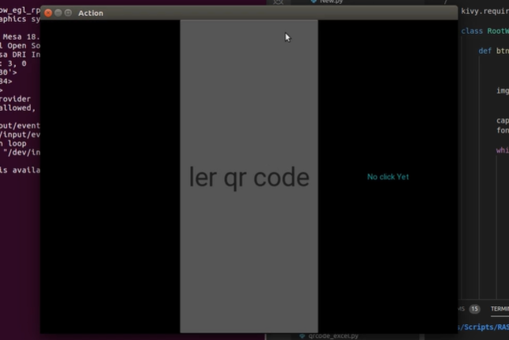
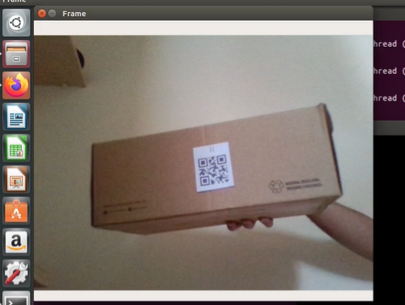
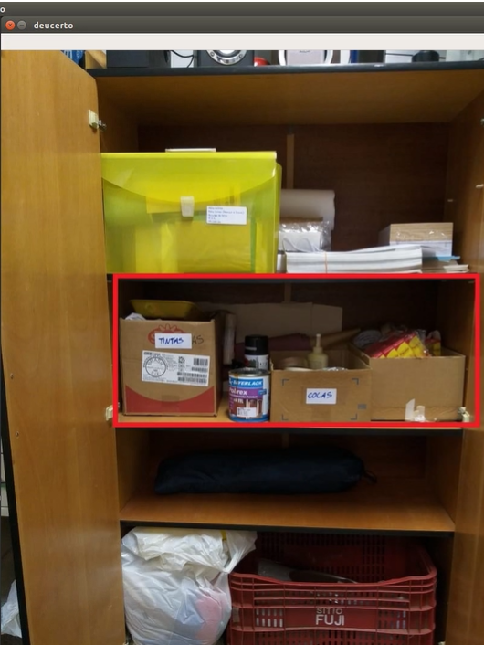

# QR-Organizer
The app was built using Python3 and OpenCV. An algorithm that reads and recognizes a given QR Code was developed, relating each one of them to an unique storaged object. The app then returns an image of the object's sector with his location marked by a bouding box. This image can also be shown by passing an registered object's name as an input.

 -->  --> 

In addition, you can write the name of the object, such as "resistors", and receive the same image that would appear identifying the QR of the "resistors".

The code was implemented into an .apk app, being designed to work with Android. 

# Prerequisites
We used a notebook with Linux Ubuntu 16.04 LTS and 18.04 LTS, others versions and operating systems were not tested. We also used an android device for the whole project.

## Python 3.6 
Python 3.6 was used for the project

## Anaconda 3.8.0
We kept the envornments organized with anaconda 3.8.0. More info [here](https://www.anaconda.com/products/individual)

## OpenCV 4.1.2
OpenCV was used to identify QR Codes, analise them and manipulate images.

## Kivy 1.11.0
We built a iterface with python using the kivy library.

## Buildozer 0.39
To convert the code to .apk format and send it to an android device, we used buildozer.

# Building an apk by yourself
Clone this repository:

	git clone https://github.com/ArturStarling/QR-Organizer
	
Install anaconda(optional). How to download and install anaconda is documented [here](https://docs.anaconda.com/anaconda/install/).
Create an environment:

	conda create -n [repository name]
	
Then activate it:

	conda activate [repository name]
	
Now you need to install python 3.6:

	conda install python==3.6

Install all libraries([OpenCV](https://anaconda.org/conda-forge/opencv), [Kivy](https://anaconda.org/conda-forge/kivy) and [Buildozer](https://anaconda.org/travis/buildozer)) and their dependecies(for [buildozer](https://buildozer.readthedocs.io/en/latest/installation.html))

Now connect your cellphone(developer mode needs to be activated) in your computer and then execute the following commands:
	
	buildozer init

	buildozer android debug deploy run

# Test it on your android device:
1. Download the apk on your android device
2. Create and print QR codes with numeration, for example 1 to 10.

With that, you can already recognize some QR codes and return some images
