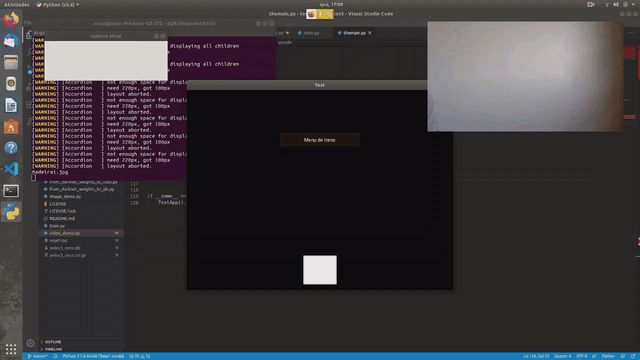

# QR-Organizer

**Authors:** [Adriel Bombonato](https://github.com/Adribom), [Paulo Gigliotii](https://github.com/paulo-gigliotti), [Bruno Bicas](https://github.com/BrunoBicas), [Mariano Correia](https://github.com/mariano-correia), [Artur Starling](https://github.com/ArturStarling)

The app was built using Python3 and OpenCV. An algorithm that reads and recognizes a given QR Code was developed, relating each one of them to an unique storaged object. The app then returns an image of the object's sector with his location marked by a bouding box. 

The video above show some of the code functions. Like a photo being taken by a webcam and, because there was a QR Code with data equals to 1, it returned the image of where the object should be. Also a dropdown with some of the registred itens. 

The code was implemented into an .apk app, being designed to work with Android. 

# Prerequisites
We used a notebook with Linux Ubuntu 16.04 LTS and 18.04 LTS, others versions and operating systems were not tested. We also used an android device for the whole project.

## Python 3.6 
Python 3.6 was used for the project

## Anaconda 3.8.0
We kept the environments organized with anaconda 3.8.0. More info [here](https://www.anaconda.com/products/individual)

## OpenCV 4.1.2
OpenCV was used to identify QR Codes, analise them and manipulate images.

## opencv-contrib-python 4.2.0.34
Some OpenCV packages to enable the use of the QR Code reader. 

## Kivy 1.11.0
We built a interface with python using the kivy library.

## Buildozer 0.39
To convert the code to .apk format and send it to an android device, we used buildozer.

# Building an apk by yourself
Note: at the time of writting this README.md, buildozer only works on linux plataforms
## Prepare Conda:
Clone this repository:

	git clone https://github.com/ArturStarling/QR-Organizer
	
Install anaconda. How to download and install anaconda is documented [here](https://docs.anaconda.com/anaconda/install/).
Create an environment:

	conda create -n [repository name]
	
Then activate it:

	conda activate [repository name]
	
Now you need to install python 3.6:

	conda install python==3.6

## Install all libraries:

[OpenCV](https://anaconda.org/conda-forge/opencv):

	conda install -c conda-forge opencv	

[Kivy](https://anaconda.org/conda-forge/kivy):

	conda install -c conda-forge kivy

[Buildozer](https://anaconda.org/travis/buildozer):

	conda install -c travis buildozer

## Install some dependencies for OpenCV and Buildozer:

For **Buildozer** we recommend that you follow the [documentation](https://buildozer.readthedocs.io/en/latest/installation.html) of the installation.

[OpenCV](https://pypi.org/project/opencv-contrib-python/):

	conda install -c michael_wild opencv-contrib
	
or

	pip install opencv-contrib-python
	
## Build the .apk:
Now connect your cellphone(developer mode needs to be activated) in your computer and, inside the folder where main.py is, execute:
	
	buildozer init
	
And then:

	buildozer android debug deploy run
	
Note: the command *buildozer init* crates a .spec file with the configurantions of your app. if you are having problem with *buildozer android debug deploy run* you may want to use the configuration in the .spec we provided inside the testi folder.

# Test it on your computer
To execute the code on your computer you will need to follow the same steps in the previous section until installing the libraries, but buildozer library and dependencies are not mandatory.

Then execute themain.py, wich is inside testi folder:
	
	pyhton3 main.py 

# Test it on your android device:
1. Download the apk on your android device
2. Create and print QR codes with numeration, for example 1 to 10.

With that, you can already recognize some QR codes and return some example images.
