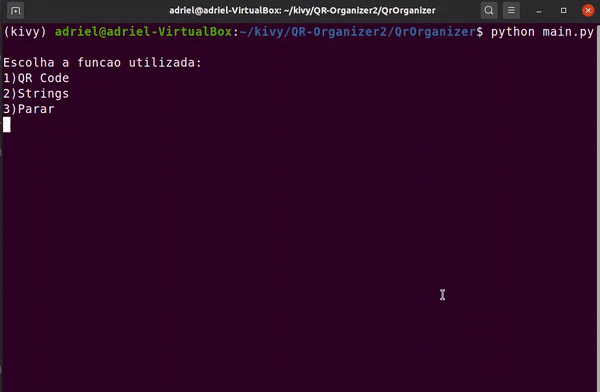

# QR-Organizer

**Authors:** [Adriel Bombonato](https://github.com/Adribom), [Paulo Gigliotii](https://github.com/paulo-gigliotti), [Bruno Bicas](https://github.com/BrunoBicas), [Mariano Correia](https://github.com/mariano-correia), [Artur Starling](https://github.com/ArturStarling)

The code was built using programing languege Python3 and some libraries. The algorithm reads and recognizes registered QR Codes, relating each one of them to an unique storaged object. It returns an image of the object's sector. That is also the option to write the object's name and receive the same image.

The video above show an registered object with QR Code value equal to one being recognized and returning an image with its storage location, wich was demarcated with a red boulding box.

 Typing the object's name wil return the same image.
 

# Prerequisites
We used a notebook with Linux Ubuntu 16.04 LTS and 18.04 LTS, others versions and operating systems were not tested. We also used an android device for the whole project.

## Python 3.7 
Python 3.7 was used for the project

## Anaconda 3.8.0
We kept the environments organized with anaconda 3.8.0. More info [here](https://www.anaconda.com/products/individual)

## OpenCV 4.1.2
OpenCV was used to analise and manipulate images.

## Pyzbar
Pyzbar has a great QR detection algorithm that enables fast code returns.  

## Openpyxl
We can communicate the main conde with an excel file with Openpyxl.

# Installation
## Prepare Conda:
Install anaconda. Downloading and installing varies on some operating systems. Read the official guide to install [here](https://docs.anaconda.com/anaconda/install/).
Create an environment with python 3.7:

	conda create -n [repository name] python==3.7.0
	
Then activate it:

	conda activate [repository name]
	

## Install all libraries:

[OpenCV](https://pypi.org/project/opencv-python/):

	pip install opencv-python	

[Numpy](https://anaconda.org/anaconda/numpy):

	conda install -c anaconda numpy

[Openpyxl](https://anaconda.org/anaconda/openpyxl):

	conda install -c anaconda openpyxl

[Pyzbar](https://anaconda.org/lightsource2-tag/pyzbar):

	conda install -c lightsource2-tag pyzbar
	

# Test it 
Clone this repository:

	git clone https://github.com/ArturStarling/QR-Organizer
	
Execute *main.py*:
	
	pyhton main.py
	
On the QrCode reader function, use an Qrcode generated by the number 1 or 2

# Modify it to your needs
## Register new objects
Put new images in the *images* folder and open the QrOrganizer excel folder, where itens (different rows) are associated with it's atributes (different columns). On the Key column, write the QR Code data that will be associated and attached to your object (it have to be a number). On the object column, put the name that you want to type when searching for the iten. And on the diretory row write the location of the image that was put in *images* folder (for example images/closet1.png).

